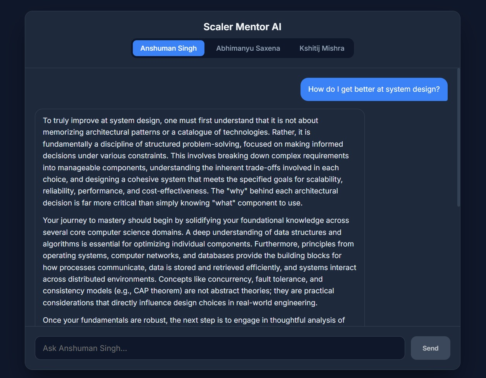
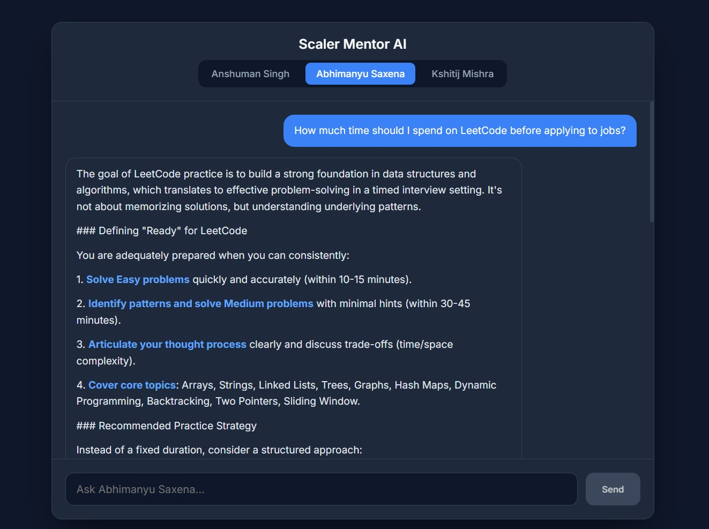
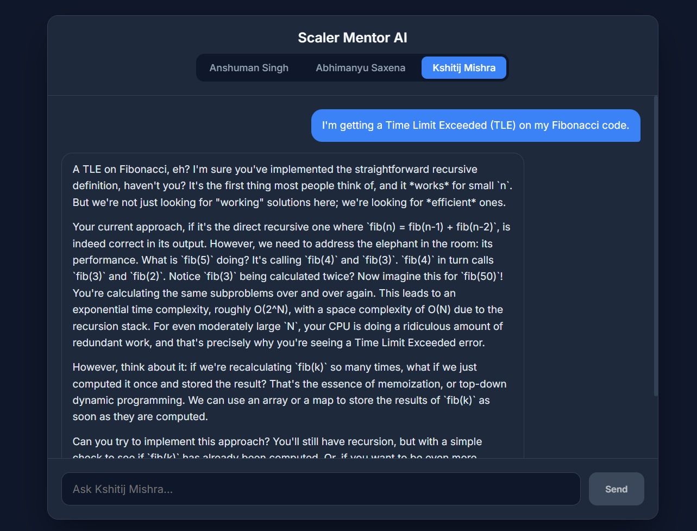

<div align="center">
  <h1>✨ Scaler Persona-Based AI Chatbot</h1>
  <p><i>A deeply context-aware, highly structured AI mentoring platform.</i></p>
  
  [](https://nextjs.org/)
  [](https://reactjs.org/)
  [](https://groq.com/)
  [](https://ai.google.dev/)
  [](https://vercel.com/)
</div>

<br />

Welcome to **Assignment 01**! This application allows users to experience real, context-driven conversations with three prominent Scaler personalities: **Anshuman Singh**, **Abhimanyu Saxena**, and **Kshitij Mishra**. 

By utilizing rigorous system prompt engineering (including Few-Shot Learning, Chain-of-Thought reasoning, and strict behavioral constraints), the platform leverages **Groq (Llama 3.3)** and **Google Gemini** to effortlessly embody their unique mentoring styles, values, and teaching paradigms.

---

## 📸 Screenshots

<div align="center">
  <table>
    <tr>
      <td></td>
      <td></td>
    </tr>
    <tr>
      <td colspan="2" align="center"></td>
    </tr>
  </table>
</div>

---

## 🌟 Key Features

* 🎭 **Dynamic Persona Switching**: Seamlessly toggle between three distinct educators. The conversation resets and suggestion chips adapt instantly upon switching.
* 🧠 **Robust Prompt Architecture**: Powered by advanced prompt engineering embedded directly in the API route, preventing prompt-injection and guaranteeing hyper-realistic responses.
* 🎨 **Premium UI/UX**: Built with purely Vanilla CSS modules—featuring glassmorphism, fluid micro-animations, a responsive layout, and an active typing indicator.
* 🔒 **Secure Execution**: API keys are securely stored on the server-side (`/api/chat`), ensuring absolute safety from frontend exposure.
* ⚡ **Zero-Config Deployment**: Engineered using the Next.js App Router to automatically deploy the frontend and backend in one single, frictionless Vercel deployment.

---

## 🛠️ Technology Stack

| Area | Technology | Reason for Choice |
| :--- | :--- | :--- |
| **Frontend** | React (Next.js 15) | Chosen for its robust App Router architecture and React state management. |
| **Backend** | Next.js API Routes | Serves as a secure, serverless backend to keep the API key completely hidden. |
| **Styling** | Vanilla CSS Modules | Adheres strictly to the requirement for raw CSS, achieving premium aesthetics without Tailwind. |
| **AI Integration** | `Groq Cloud` & `@google/generative-ai` | Uses Groq (Llama 3.3 70B) as the primary high-speed engine, with Gemini as a robust fallback. |

---

## 🚀 Getting Started

Follow these instructions to run the project locally on your machine.

### Prerequisites
- [Node.js](https://nodejs.org/en/) (v18 or higher)
- A valid **Groq API Key** (Recommended for speed/free tier)
- OR a valid Google Gemini API Key

### Installation

1. **Clone the repository** 
   ```bash
   git clone https://github.com/YOUR_USERNAME/YOUR_REPO_NAME.git
   cd YOUR_REPO_NAME
   ```

2. **Install dependencies**
   ```bash
   npm install
   ```

3. **Set up Environment Variables**
   Rename `.env.example` to `.env` and add your API keys:
   ```env
   GROQ_API_KEY=your_groq_api_key_here
   GOOGLE_GENERATIVE_AI_API_KEY=your_gemini_api_key_here
   ```

4. **Start the Development Server**
   ```bash
   npm run dev
   ```
   *Open [http://localhost:3000](http://localhost:3000) in your browser to see the result.*

---

## 🌐 Deployment

This application is optimized for Vercel. 

1. Push your code to a public GitHub repository.
2. Log into [Vercel](https://vercel.com/) and click **"Add New Project"**.
3. Import your newly created repository.
4. Under **Environment Variables**, add `GROQ_API_KEY` (and optionally `GOOGLE_GENERATIVE_AI_API_KEY`).
5. Click **Deploy**.

> **Live Demo:** [Click Here to View Live Project](https://scaler-persona-switcher.vercel.app/)

---

## 📂 Documentation Deliverables

As per the assignment requirements, the following documentation files are included in the root directory:
- 📝 `prompts.md`: Contains the thoroughly structured system prompts for all 3 personas, including Few-Shot examples and Constraints.
- 💡 `reflection.md`: A ~350-word reflection dissecting the *Garbage In, Garbage Out* (GIGO) principle in prompt engineering.
- 🔑 `.env.example`: Safe template file demonstrating the necessary environment variables.
